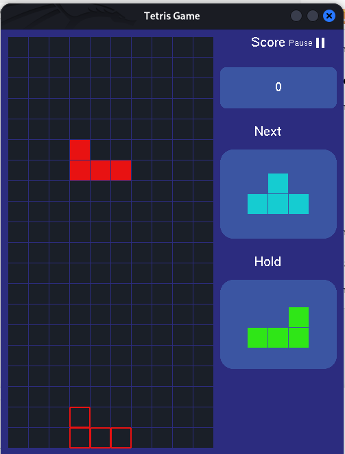

# 🎮 Tetris Game — C++ & OpenGL

A feature-rich **Tetris-style block-stacking game** developed in **C++ using OpenGL and GLUT**. The project implements classic falling-block gameplay together with modern gameplay enhancements such as **ghost-piece projection, hard drop, hold-piece functionality, progressive levels, dynamic difficulty, scoring, and custom complex blocks**.

The game uses a 10 × 20 playfield and provides both **keyboard controls** and **arrow-key controls** for gameplay.

## 📌 Features

### Core Gameplay

- Classic Tetris-style falling block mechanics
- 10 × 20 game grid
- Automatic downward movement of blocks
- Horizontal block movement
- Block rotation
- Collision detection
- Automatic block locking
- Completed-row detection and clearing
- Game-over detection
- New-game/reset functionality

### Enhanced Gameplay

- 👻 **Ghost Piece**
  - Displays the projected landing position of the current block.
  - Helps players accurately position pieces before dropping them.

- ⚡ **Hard Drop**
  - Instantly drops the current block piece to its lowest valid position.
  - Awards additional points based on the drop distance.

- 🔄 **Hold Piece**
  - Allows the player to store the current block piece for later use.
  - Holding is limited to once per falling piece.

- ⏸️ **Pause/Resume**
  - Temporarily stops automatic block movement.
  - Gameplay can be resumed without restarting the game.

- 📈 **Level System**
  - The game becomes progressively faster as the player's score increases.
  - The falling interval decreases with each level.
  - Additional complex blocks are introduced as the level increases.

- 🧩 **Multiple Block Types**
  - Seven standard Tetris pieces:
    - I
    - J
    - L
    - O
    - S
    - T
    - Z
  - Three additional custom complex pieces are introduced progressively.

- 🎨 **Custom OpenGL Interface**
  - Colored blocks
  - Rounded UI panels
  - Score display
  - Next-piece preview
  - Hold-piece preview
  - Level indicator
  - Game-over and pause indicators
  - Level-up notification

## 🕹️ Controls

| Action         | Keyboard                  | Arrow Keys |
| -------------- | ------------------------- | ---------- |
| Move Left      | `L` / `l`                 | ←          |
| Move Right     | `R` / `r`                 | →          |
| Move Down      | `D` / `d`                 | ↓          |
| Rotate         | `W` / `w`                 | ↑          |
| Hard Drop      | `Space`                   | —          |
| Pause / Resume | `P` / `p`                 | —          |
| Hold Piece     | `C` / `c` / `H` / `h`     | —          |
| Start New Game | `N` / `n` after Game Over | —          |

### Control Details

**Move Left / Right**

Moves the active piece horizontally while preventing it from leaving the board or overlapping existing blocks.

**Move Down**

Moves the piece down one row. Manual downward movement also awards a small score bonus.

**Rotate**

Rotates the current block through its available rotation states. Invalid rotations are automatically rejected.

**Hard Drop**

Press `Space` to immediately move the current block to its lowest possible position and lock it into the board.

**Hold**

Press `C` or `H` to store the current piece. A held piece can be swapped with the active piece, but holding is restricted to once per turn.

**Pause**

Press `P` to pause or resume the game.

**New Game**

After game over, press `N` to reset the board and start a new game.

## 🧩 Block Types

### Standard Pieces

The game implements the seven conventional Tetris pieces:

|  ID | Piece | Description                 |
| --: | ----- | --------------------------- |
|   1 | L     | L-shaped tetromino          |
|   2 | J     | Mirrored L-shaped tetromino |
|   3 | I     | Straight four-cell piece    |
|   4 | O     | Square piece                |
|   5 | S     | S-shaped tetromino          |
|   6 | T     | T-shaped tetromino          |
|   7 | Z     | Z-shaped tetromino          |

### Custom Complex Pieces

The game also introduces three larger pieces:

|  ID | Piece         | Cells |
| --: | ------------- | ----: |
|   8 | ComplexBlock1 |     5 |
|   9 | ComplexBlock2 |     8 |
|  10 | ComplexBlock3 |     9 |

These pieces are progressively added to the random piece pool as the player reaches higher levels.

This provides an additional difficulty component beyond simply increasing the falling speed.

## 📊 Scoring System

The scoring system rewards both completed lines and player-controlled movement.

### Line Clearing

| Lines Cleared |        Points |
| ------------: | ------------: |
|             1 |          +100 |
|             2 |          +300 |
|             3 |          +600 |
|            4+ | `lines × 250` |

### Movement Bonuses

| Action      |             Points |
| ----------- | -----------------: |
| Manual Down |                 +1 |
| Hard Drop   | +2 per row dropped |

The final score for a turn is calculated by combining line-clear points with movement/drop bonuses.

## 📈 Level Progression

The game starts at **Level 1** and progressively increases the difficulty.

When the player's score reaches the required threshold:

1. The level increases.
2. The score threshold for the next level increases.
3. The automatic falling interval decreases.
4. The board is reset.
5. A new pair of current/next pieces is generated.
6. A new complex block is introduced into the piece pool.
7. A temporary **LEVEL UP!** message is displayed.
8. The held piece is cleared.

### Falling Speed

The initial falling interval is: `500 ms`. Each level reduces the interval by: `100 ms` with a minimum interval of: `100 ms`. Therefore, higher levels make the pieces fall substantially faster.

## 👻 Ghost Piece

The ghost-piece system calculates the lowest valid position of the currently active block.

The algorithm:

1. Creates a copy of the current block.
2. Moves the copy downward one row at a time.
3. Checks whether the new position is valid.
4. Stops when the next position would collide with the board or another block.
5. Moves the ghost piece back to its last valid position.
6. Draws an outline at that location.

The ghost piece is rendered as a **hollow block outline**, allowing the player to visualize exactly where the active piece will land.

## 🔄 Hold Piece System

The hold system allows players to temporarily store a block.

### First Hold

If no piece is currently held:

```text
Current Piece → Hold
Next Piece → Current Piece
New Piece → Next
```

### Subsequent Hold

If a piece is already held:

```text
Current Piece ↔ Held Piece
```

The player can only perform one hold per falling piece. The ability to hold becomes available again after the current block is locked.

## 🧱 Grid System

The game board consists of:

```text
Rows:       20
Columns:    10
Cell Size:  30 px
```

Each grid cell stores an integer representing the block occupying that position.

```text
0  → Empty cell
1  → L Block
2  → J Block
3  → I Block
4  → O Block
5  → S Block
6  → T Block
7  → Z Block
8  → Complex Block 1
9  → Complex Block 2
10 → Complex Block 3
```

The `Grid` class is responsible for:

- Board initialization
- Cell validation
- Empty-cell checking
- Row detection
- Full-row clearing
- Moving rows downward

## 🎨 Rendering System

The game uses **OpenGL immediate-mode rendering** through GLUT.

### Rendering Components

The implementation contains several reusable rendering functions:

- `plotRectangle()`
- `plotRectangleOutline()`
- `DrawCircleSegment()`
- `DrawRectangleRounded()`
- `renderBitmapString()`
- `drawText()`

These functions are used to construct the game board, blocks, ghost pieces, panels, and interface text.

### Game Interface

The window contains:



The actual rendering is handled inside the OpenGL display callback.

## 🛠️ Technologies Used

- **C++**
- **OpenGL**
- **GLUT / FreeGLUT**
- **C++ STL**
- Object-Oriented Programming
- Event-driven graphics programming
- Collision detection
- 2D geometric rendering

### Standard Libraries

The project primarily uses:

```cpp
#include <bits/stdc++.h>
```

along with:

```cpp
#include <GL/gl.h>
#include <GL/glut.h>
```

---

## 💻 Requirements

Before building the project, make sure the following are installed:

- C++ compiler with C++11 or later support
- OpenGL
- GLUT or FreeGLUT
- OpenGL development libraries

### Linux

For Debian/Ubuntu-based systems, the required packages can generally be installed with:

```bash
sudo apt update
sudo apt install build-essential freeglut3-dev
```

## 🚀 Building the Project

The source code is stored in:

```text
main.cpp
```

compile it with:

```bash
g++ main.cpp -o Tetris_Game -lglut -lGLU -lGL && ./Tetris_Game
```

A graphical window titled:

```text
Tetris Game
```

will open.

## 🖥️ Window Configuration

The game creates an OpenGL window with the following dimensions:

```text
Width:   500 px
Height:  620 px
```

The 2D coordinate system is configured using:

```cpp
gluOrtho2D(0.0, 500.0, 620.0, 0.0);
```

This allows the game to use a straightforward 2D coordinate system for rendering the board and interface.

## 🔄 Game Loop

The game uses GLUT's event-driven architecture.

### Main Loop

```text
GLUT Initialization
        │
        ▼
Create Game Window
        │
        ▼
Initialize OpenGL
        │
        ▼
Register Callbacks
        │
        ├───────────────┐
        │               │
        ▼               ▼
   Input Events     Timer Event
        │               │
        ▼               ▼
  Update Game       Move Block
        │               │
        └───────┬───────┘
                ▼
          Redraw Screen
                │
                ▼
          Repeat Loop
```

### Main GLUT Callbacks

| Callback                | Responsibility                    |
| ----------------------- | --------------------------------- |
| `display()`             | Renders the complete game         |
| `handleInput()`         | Processes normal keyboard input   |
| `handleSpecialInput()`  | Processes arrow keys              |
| `update()`              | Controls automatic block falling  |
| `clearLevelUpMessage()` | Removes the level-up notification |

## 🔍 Collision Detection

Collision detection is performed before allowing a block movement or rotation.

A block is considered invalid when:

- A cell moves outside the board boundaries.
- A cell overlaps an already occupied grid cell.

The implementation separates these checks through: `isBlockOutside()` and: `isBlockFits()`

This makes movement and rotation validation easier to manage.

## 🧹 Line Clearing

When a piece is locked into the grid, the game checks every row to determine whether it is completely filled.

A full row is identified when: `Every cell in the row != 0`

Completed rows are removed and the rows above them are shifted downward.

This is implemented through: `clearFullRows()` and: `moveRowDown()`

## 🏁 Game Over

A game-over condition occurs when the next generated piece cannot fit into the board after the current piece is locked.

When this happens: `GAME OVER`is displayed.

The player can start a new game by pressing: `N`

## 🧪 Gameplay Flow

A typical gameplay session follows this sequence:

```text
Start Game
    │
    ▼
Generate Current + Next Piece
    │
    ▼
Piece Falls Automatically
    │
    ├── Move Left / Right
    ├── Rotate
    ├── Move Down
    ├── Hold
    └── Hard Drop
    │
    ▼
Piece Locks Into Grid
    │
    ▼
Check Completed Rows
    │
    ▼
Update Score
    │
    ▼
Check Level Progression
    │
    ├── Continue Game
    │
    └── Increase Level
             │
             ▼
       Increase Difficulty
    │
    ▼
Generate Next Piece
    │
    ▼
Repeat
```

## ✨ Design Highlights

### Object-Oriented Block Design

All pieces inherit from a common `Block` class, allowing shared functionality for:

- Movement
- Rotation
- Position calculation
- Rendering
- Ghost-piece rendering

New block types can therefore be introduced without rewriting the core game engine.

### Dynamic Piece Pool

The game maintains a pool of available pieces. Standard pieces are available initially, while complex pieces are progressively introduced as the player levels up.

### Separation of Game Logic and Rendering

Game state and gameplay mechanics are primarily handled by the `Game`, `Grid`, and `Block` classes, while OpenGL functions handle visual presentation.

### Real-Time Gameplay

The GLUT timer provides automatic block movement and continuous rendering without requiring a manually controlled game loop.

## 🚧 Possible Future Improvements

The current implementation provides a strong foundation for further development. Potential improvements include:

- [ ] Add a start menu
- [ ] Add a game settings screen
- [ ] Add sound effects
- [ ] Add background music
- [ ] Add persistent high scores
- [ ] Add leaderboard support
- [ ] Add configurable controls
- [ ] Add wall-kick rotation logic
- [ ] Add smoother animations
- [ ] Add particle effects
- [ ] Add additional custom blocks
- [ ] Add difficulty-selection modes
- [ ] Add multiplayer support
- [ ] Replace OpenGL immediate mode with modern OpenGL
- [ ] Add automated unit tests for game logic

## 🐛 Known Implementation Considerations

This project is primarily designed as a desktop OpenGL game and therefore requires an environment capable of creating an OpenGL/GLUT window.

The implementation uses legacy OpenGL immediate-mode functions such as:

```cpp
glBegin()
glEnd()
glVertex2f()
glColor4f()
```

## 🎯 Project Objectives

The project demonstrates practical implementation of several computer graphics and software engineering concepts:

- 2D graphics rendering
- OpenGL programming
- GLUT event handling
- Object-oriented programming
- Data structures
- Collision detection
- Geometric transformations
- State management
- Real-time game loops
- Dynamic difficulty adjustment
- User input handling
- Algorithmic row manipulation

## 📄 License

This project can be distributed under the license specified by the repository owner.

## 👨‍💻 Author

**Ruhul Amin Sharif**

Computer Science and Engineering  
Premier University, Chattogram, Bangladesh

## ⭐ Acknowledgment

This project was developed as an implementation of a classic block-stacking game using C++ and OpenGL, with additional gameplay mechanics designed to improve the traditional Tetris experience.

If you find the project useful or interesting, consider giving the repository a ⭐.
